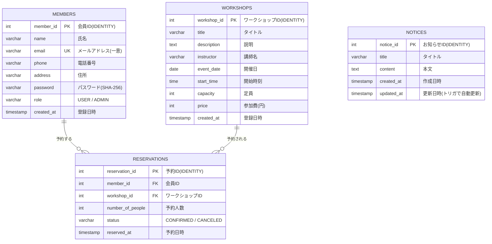

# ER図（Entity Relationship Diagram）

陶芸体験ワークショップ予約システムのデータベース構造です。
（GitHub 上では Mermaid が図として描画されます）

## リレーションと制約

| 関係 | 内容 |
|------|------|
| `members` 1 — * `reservations` | 1人の会員は複数の予約を持てる。会員削除時は予約も削除（`ON DELETE CASCADE`） |
| `workshops` 1 — * `reservations` | 1つのWSは複数の予約を持てる。WS削除時は予約も削除（`ON DELETE CASCADE`） |
| `notices` | 他テーブルと関連を持たない独立テーブル |

### 主な制約
- `members.email` … **UNIQUE**（重複登録の防止）
- `members.role` / `reservations.status` … **CHECK制約**で許可値を限定
- `reservations` … **部分一意インデックス** `uq_active_reservation`
  `(member_id, workshop_id) WHERE status='CONFIRMED'`
  → 「確定」状態でのみ重複を禁止し、**キャンセル後の再予約を許容**する
- `notices.updated_at` … **トリガ** `trg_notices_updated_at` で更新時に自動更新
