# 機能別クラス図（JSP含む・フィールド/メソッド明示）

ユーザー側・管理者側のクラス図を**機能ごとに分解**し、各図に以下を**省略せず**含めています。

- **JSP（View）** … `«JSP»` ステレオタイプで表示。フォームの送信先（form action）や
  読み取る request 属性を記載。Servlet との関係は「forward（表示）」「POST（送信）」で表現。
- **全フィールド・全メソッド** … DTOは全フィールド、DAO/Serviceは private の
  `mapRow()` / `validate()` まで明示。Servletは `doGet`/`doPost` と private ヘルパまで記載。
  （多数のアクセサは `+getterSetter() 全フィールド分` の1行で代表表記）
- 管理者系は前段の **`AdminAuthFilter`**（IP許可リスト＋管理者認証）も含む。

ソース（Mermaid）は [`diagrams/by-function/`](diagrams/by-function/) にあります。
フィルタの動作詳細は [`class-diagram-by-role.md`](class-diagram-by-role.md) を参照。

---

## ユーザー側

### U-1 会員登録
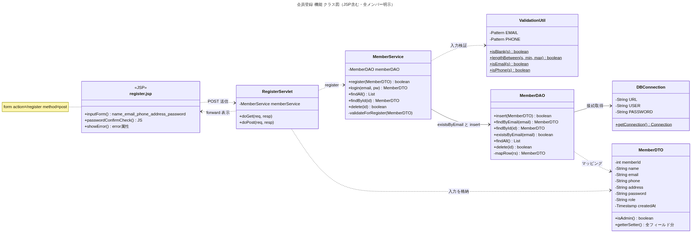

### U-2 ログイン / ログアウト
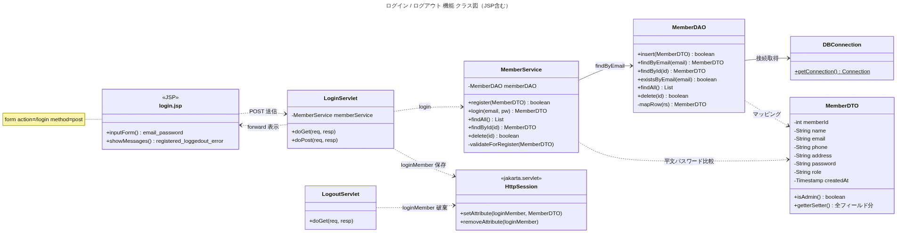

### U-3 メイン表示（一覧・カレンダー・お知らせ）
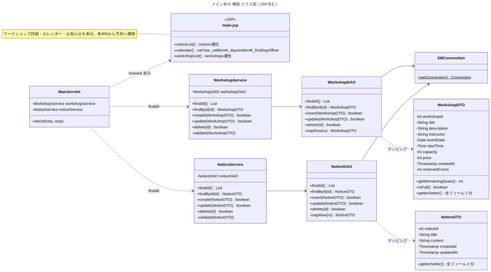

### U-4 予約（コース選択含む）
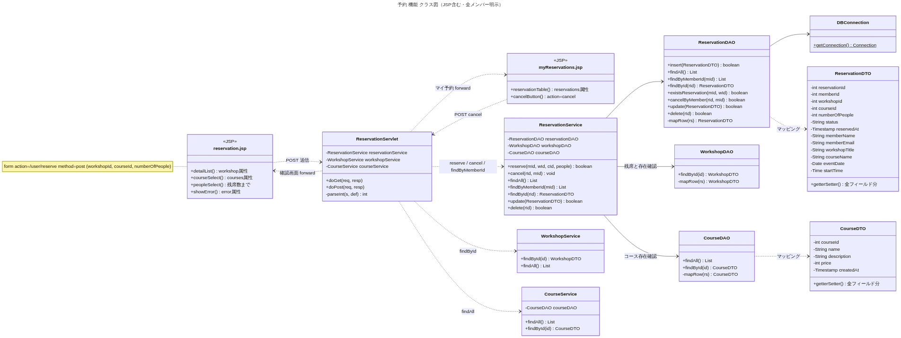

### U-5 予約キャンセル
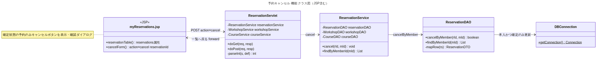

---

## 管理者側（前段に AdminAuthFilter）

### A-1 管理者ログイン
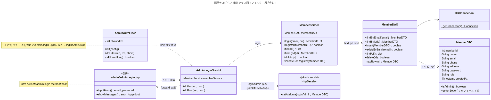

### A-2 ダッシュボード
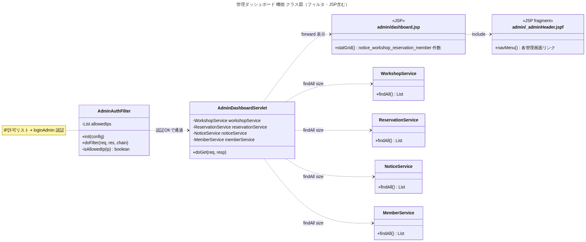

### A-3 お知らせ管理（追加 / 編集 / 削除）
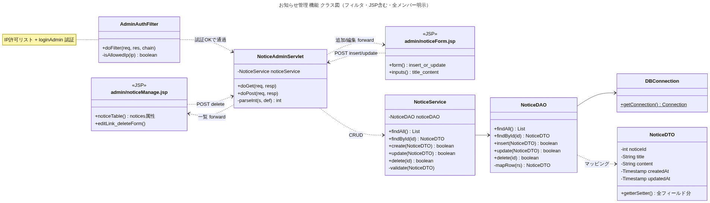

### A-4 ワークショップ管理（追加 / 編集 / 削除）
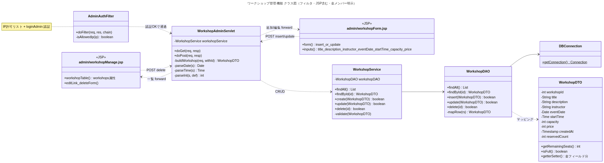

### A-5 予約管理（編集 / 削除）
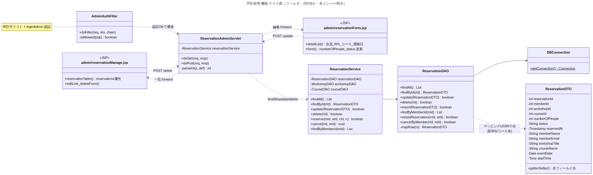

### A-6 会員管理（削除のみ）
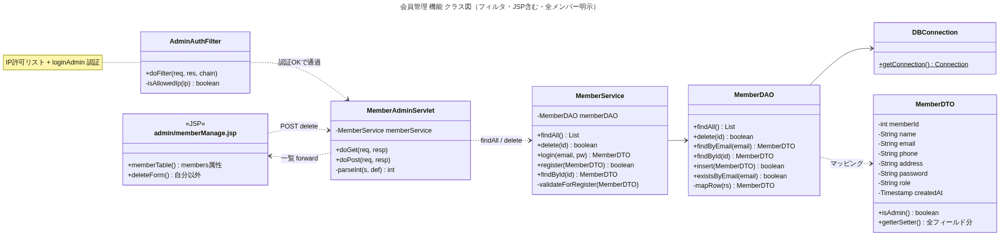

---

> 補足: 図中の `«JSP»` は画面（View）、戻り矢印の「POST 送信」はフォーム送信、
> 「forward 表示」は Servlet から JSP への画面表示を表します。
> Service統合版（`/combined`）は Service を介さず Servlet が同等のロジックを
> 直接持つ構成です（[README](../README.md) の「2つの構成」を参照）。
