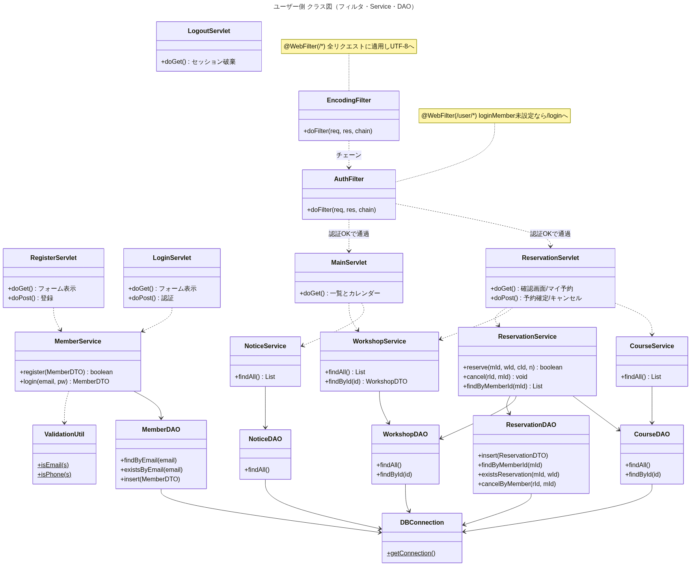
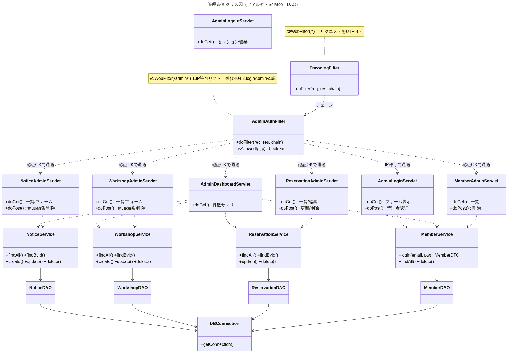
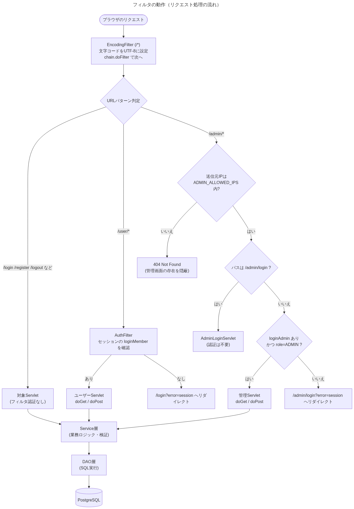

# クラス図（ユーザー側 / 管理者側）とフィルタの動作

全体クラス図を、利用者の役割ごとに **ユーザー側** と **管理者側** に分け、
さらに **フィルタ（Filter）の動作** を詳しく示します。
（標準の MVC分離版を対象。全体図は [`class-diagram.md`](class-diagram.md)、
処理別は [`process-class-diagrams.md`](process-class-diagrams.md) を参照）

---

## 1. ユーザー側 クラス図
一般会員が使う画面（登録・ログイン・メイン・予約・キャンセル）に関わるクラスです。
`EncodingFilter`（全体）と `AuthFilter`（`/user/*`）が前段に入ります。

- `RegisterServlet` / `LoginServlet` / `LogoutServlet` は `/user/*` の**外**なので
  `AuthFilter` の対象外（誰でもアクセス可能）。`EncodingFilter` だけ通ります。
- `MainServlet` / `ReservationServlet` は `/user/*` 配下なので、未ログインだと
  `AuthFilter` に弾かれて `/login` へ。

## 2. 管理者側 クラス図
管理画面（ダッシュボード＋お知らせ/ワークショップ/予約/会員の管理）に関わるクラスです。
前段に `EncodingFilter`（全体）と `AdminAuthFilter`（`/admin/*`）が入ります。

- `AdminAuthFilter` は **IP許可リスト** と **管理者ログイン** の2段でガードします。
- `AdminLoginServlet` は認証対象外（IPさえ通ればログイン画面を表示）。

---

## 3. フィルタの動作（詳細）

リクエストは Servlet に届く前に Filter を通ります。本アプリのフィルタは3つです。

### (a) EncodingFilter — `@WebFilter("/*")`
- **対象**: すべてのリクエスト。
- **動作**: `request.setCharacterEncoding("UTF-8")` と
  `response.setCharacterEncoding("UTF-8")` を設定してから `chain.doFilter()` で次へ進む。
- **目的**: フォーム入力（日本語）の文字化け防止。**他のどのフィルタ／Servletより前**に
  文字コードを確定させる必要があるため、全URLに掛けている。

### (b) AuthFilter — `@WebFilter("/user/*")`
- **対象**: `/user/*`（メイン・予約など会員専用ページ）。
- **動作**:
  1. `request.getSession(false)` で**既存**セッションを取得（無ければ作らない）。
  2. セッション属性 `loginMember` を見る。
  3. **あり** → `chain.doFilter()` で Servlet へ通す。
  4. **なし** → `/login?error=session` へ **リダイレクト**して処理を止める。
- **ポイント**: ログイン情報はログイン成功時に `loginMember` としてセッションに格納され、
  ログアウト（属性削除）まで保持される。`/login` `/register` は `/user/*` の外なので
  このフィルタは通らない（未ログインでもアクセスできる）。

### (c) AdminAuthFilter — `@WebFilter("/admin/*")`
管理画面を **店舗端末のIPからのみ** に限定し、かつ管理者ログインを要求します。
- **対象**: `/admin/*`。
- **動作（上から順に判定）**:
  1. **IP許可リスト**: `request.getRemoteAddr()` が `ADMIN_ALLOWED_IPS`
     （システムプロパティ/環境変数, カンマ区切り・末尾`*`で前方一致）に含まれるか判定。
     含まれなければ **404 Not Found** を返す（存在を隠蔽）。
  2. **ログイン画面の除外**: パスが `/admin/login` ならログイン処理自体なので、
     認証チェックはせず通す（IPは通過済み）。
  3. **管理者認証**: セッション属性 `loginAdmin` があり、かつ `role=ADMIN` か。
     - **OK** → `chain.doFilter()` で管理Servletへ。
     - **NG** → `/admin/login?error=session` へリダイレクト。
- **トンネル併用の注意**: cloudflared 等のトンネル経由は Tomcat から `127.0.0.1` に
  見えるため、許可リストにループバックを含めると外部から到達可能になる。店舗端末限定に
  したい場合は実IPのみを設定する。

### フィルタの登録順について
`@WebFilter` アノテーションだけでは複数フィルタの**実行順序は保証されません**
（コンテナ依存）。本アプリは各フィルタの責務が独立（文字コード設定／会員認証／
管理者認証）しているため順序に依存しませんが、厳密な順序が必要な場合は
`web.xml` の `<filter-mapping>` 記述順で制御します。

### Service統合版（/combined）のフィルタ
統合版も同じ構造で、独立したフィルタを持ちます。
- `CombinedAuthFilter`（`/combined/user/*`）… セッション属性 `cbLoginMember` を確認。
- `CombinedAdminAuthFilter`（`/combined/admin/*`）… IP許可リスト＋ `cbLoginAdmin` を確認。

セッション属性名を分けることで、既存版とログイン状態が**完全に独立**しています。
