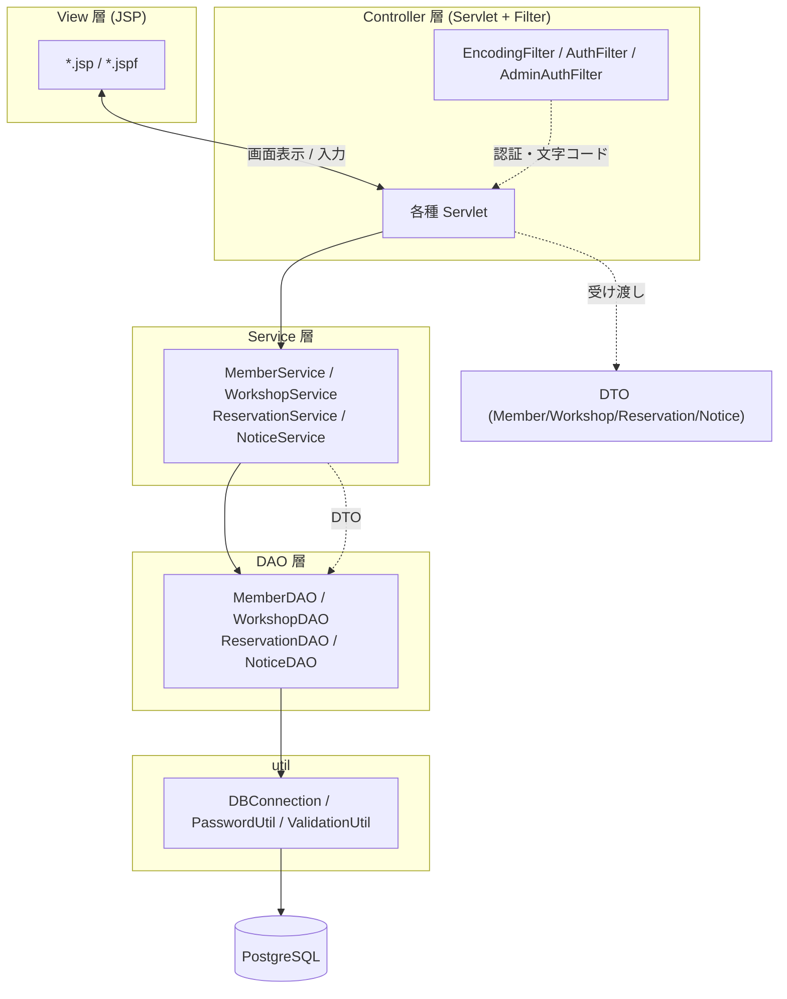
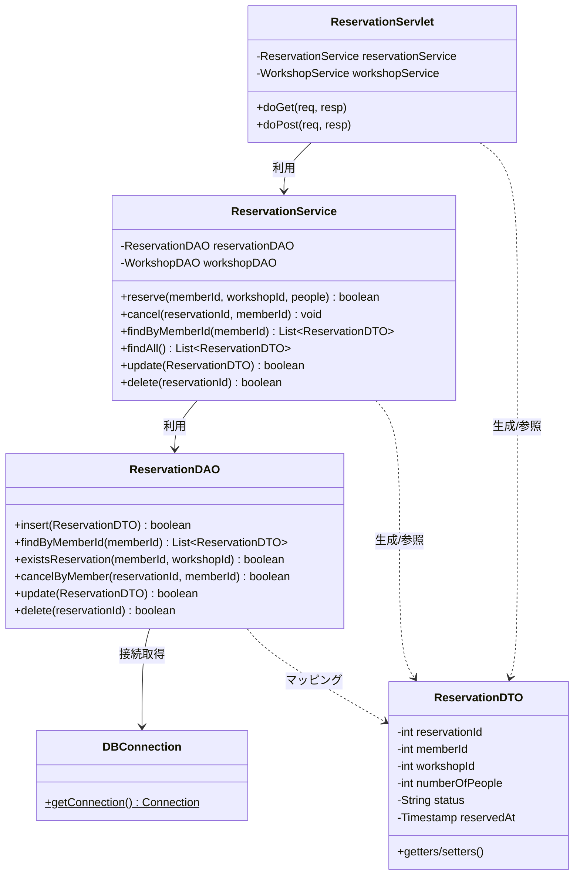
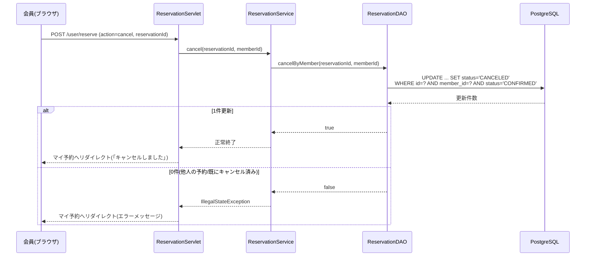

# クラス図（Class Diagram）

MVCモデル（DAO / DTO / Service / Servlet / JSP）の構造を示します。
矢印は依存方向（呼び出し方向）です。Servlet → Service → DAO → DB の流れで、
データは DTO に詰めて各層を受け渡します。

## 全体レイヤ構成

## 主要クラスの関係（予約まわりを例に）

## 予約キャンセルのシーケンス

