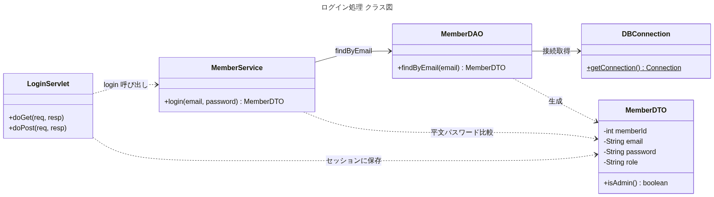
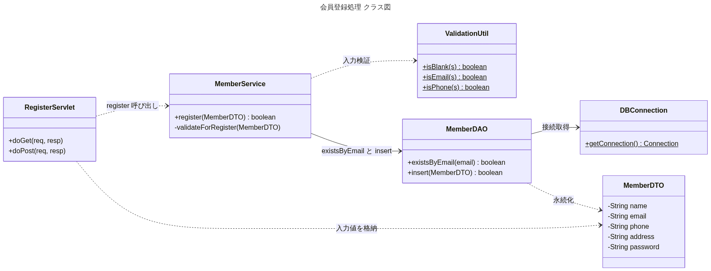
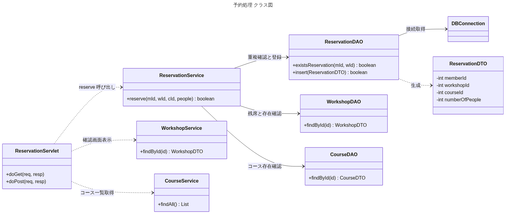
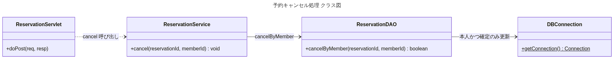
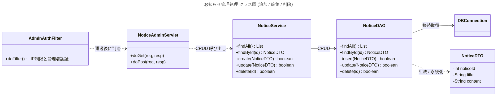

# 処理別クラス図

主要な処理ごとに、関与するクラスとメソッド、呼び出し関係を示したクラス図です。
（全体クラス図は [`class-diagram.md`](class-diagram.md) / [`diagrams/class.png`](diagrams/class.png) を参照）

> **補足:** 全体クラス図ではServletのメソッドを省略していましたが、各Servletは
> `HttpServlet` を継承し `doGet()` / `doPost()` を持ちます。以下の処理別図では
> それらを明記しています。Servletが「受付（Controller）」、Serviceが「業務ロジック」、
> DAOが「DBアクセス」と役割分担し、`Servlet → Service → DAO → DBConnection` の
> 一方向で呼び出します。

各図のソース（Mermaid）は [`diagrams/process/`](diagrams/process/) にあります。

---

## 1. ログイン処理
`LoginServlet.doPost` がメール＋パスワードを受け取り、`MemberService.login` で
`MemberDAO.findByEmail` の結果と**平文比較**。成功時は `MemberDTO` をセッションに保存します。

## 2. 会員登録処理
`RegisterServlet.doPost` → `MemberService.register`。`ValidationUtil` で入力検証し、
`MemberDAO.existsByEmail` で重複確認後、`insert` で保存します（パスワードは平文）。

## 3. 予約処理
`ReservationServlet` は確認画面表示（`doGet`）で `WorkshopService`・`CourseService` を、
予約確定（`doPost`）で `ReservationService.reserve` を呼びます。Serviceは
`WorkshopDAO`（残席/存在）・`CourseDAO`（コース存在）・`ReservationDAO`（重複確認/登録）を使います。

## 4. 予約キャンセル処理
`ReservationServlet.doPost(action=cancel)` → `ReservationService.cancel` →
`ReservationDAO.cancelByMember`。**本人かつ確定状態の予約のみ** CANCELED に更新します。

## 5. お知らせ管理処理（追加 / 編集 / 削除）
管理系は `AdminAuthFilter`（IP制限＋管理者認証）を通過後に `NoticeAdminServlet` に到達。
`doGet` で一覧/フォーム表示、`doPost` で `NoticeService` のCRUDを呼びます。
（ワークショップ管理・予約管理・会員管理も同じ構造です）

